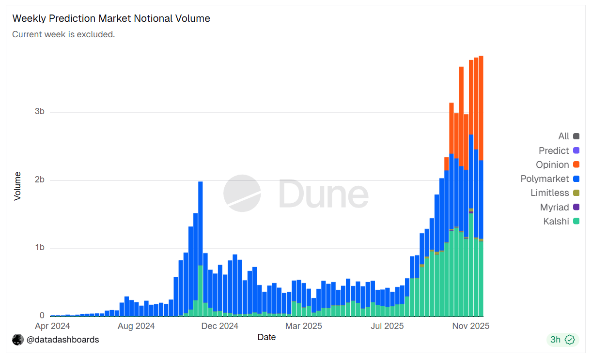

# Core Concepts

## Why Prediction Markets Matter

Prediction markets turn uncertainty into prices. When participants trade on future outcomes, market prices can act as continuously updated probability signals that reflect capital-weighted beliefs.

For Orbit, the opportunity is not just higher trading volume. The larger goal is to make prediction markets usable as probability infrastructure across more events, earlier in their lifecycle, and with better capital efficiency.

## Where Existing Markets Break Down

Most prediction markets fall into one of two structural categories:

- Orderbook-based markets
- Instant-launch AMM markets

Both can work, but both introduce scaling problems when markets become more numerous, longer-lived, or less obviously liquid.

### Orderbook-Based Markets

Orderbooks express probabilities clearly when enough traders are active. The problem is fragmentation: liquidity clusters around the most visible markets, while early-stage or long-tail markets remain thin.

Common failure modes:

- Cold-start markets with weak initial participation
- No useful role for passive capital
- Poor scalability across many simultaneous markets

### Instant-Launch AMM Markets

Instant-launch AMMs solve the "no counterparties" problem by making markets tradable immediately. But they often begin from weak informational priors. Prices can be anchored by defaults, heuristics, or the first few trades rather than by committed consensus.

They also tend to ignore time-to-expiry. That makes liquidity exposure look static even though uncertainty collapses as resolution approaches.

## Orbit's Design Thesis

Orbit is built around three ideas:

- Market initialization should be grounded in committed beliefs.
- The AMM should evolve probabilities, not invent them.
- Liquidity exposure should change over time as uncertainty declines.

## Market Growth Context

Prediction markets have expanded rapidly across crypto-native and regulated venues. Orbit's thesis is that the next step is not just more markets, but better market structure for probability formation.

The whitepaper uses this volume chart to frame the growth of the category and the need for better market infrastructure.
