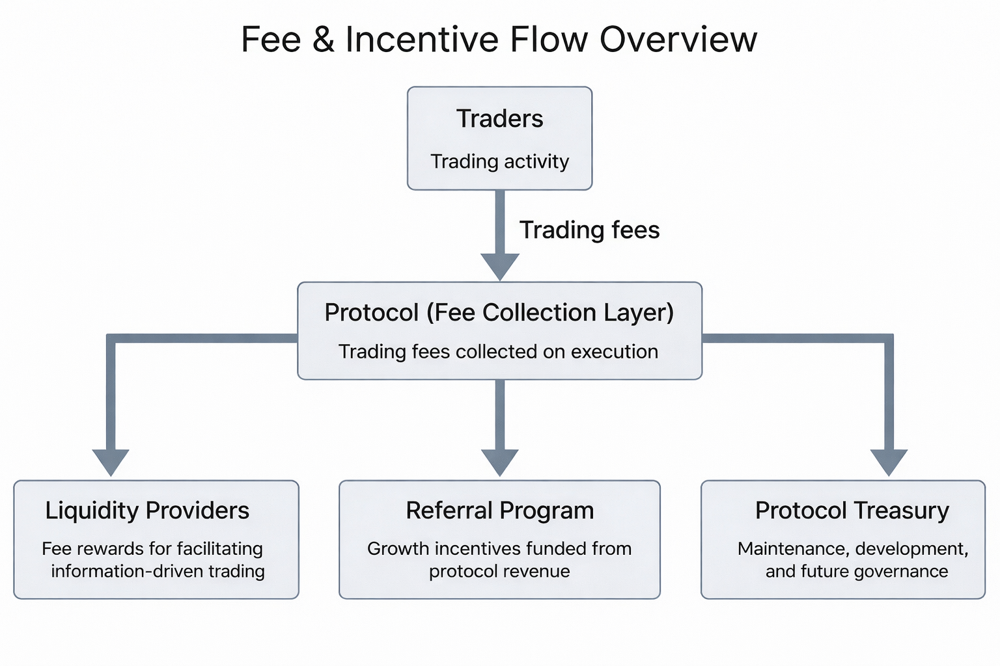

# Economics

Orbit's business model is designed to align incentives around useful probability formation rather than raw speculative throughput.

## Fee Flow

Trading fees are collected when users execute against the AMM.

The whitepaper describes three primary fee destinations:

- Liquidity providers
- Referral rewards
- Protocol treasury

## Liquidity Providers

LPs are compensated for making information-driven trading possible. Their returns come from fee generation over time, while their main risk is forecast error rather than a simple passive-yield profile.

The protocol's economic design aims to:

- reward useful liquidity rather than idle capital
- reduce late-stage risk concentration
- align fee capture with actual market support

## Traders

Traders are incentivized to identify and act on mispriced probabilities. Their returns depend on being earlier or more accurate than the market, not on supplying liquidity.

## Referral Program

The whitepaper proposes a referral system where a share of protocol revenue is used to reward ecosystem growth. Referral rewards are funded from protocol fees rather than by increasing direct trading costs for referred users.

## Liquidity Points

Orbit also proposes a liquidity points system to reward behaviors that may be strategically valuable even when they are not immediately the most profitable, such as:

- supporting thinner markets
- remaining active as liquidity decays over time
- contributing tradability near expiry

The final utility of points is still presented as subject to future design.

## Incentive Summary

Orbit's economic model is intended to reward:

- LPs for supporting belief formation and trading
- traders for correcting prices through information
- referrers for sustainable growth
- the protocol treasury for long-term maintenance and governance
