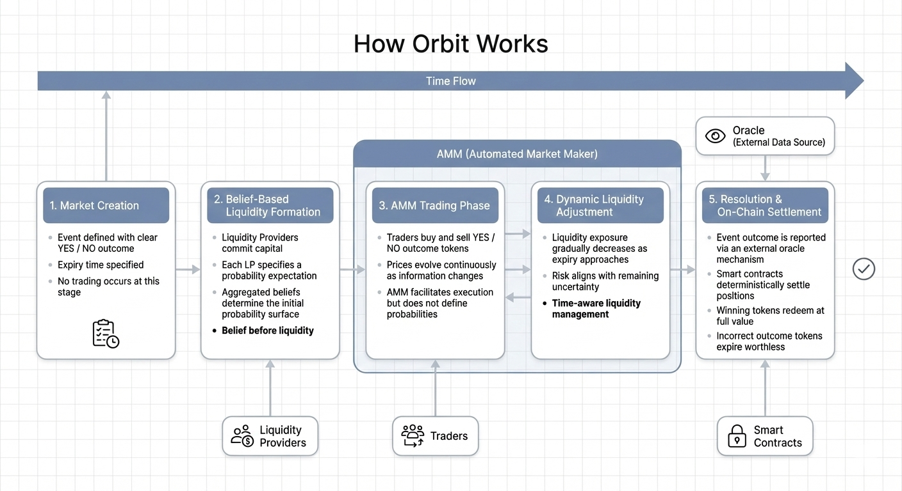

# Getting Started

## What Orbit Is

Orbit is a prediction market protocol for YES/NO outcomes. Prices are interpreted as probabilities, and markets remain continuously tradable through an automated market maker rather than direct order matching.

Orbit is designed around a simple constraint: liquidity should not come before belief. Before trading begins, liquidity providers commit capital together with explicit probability expectations. Those commitments form the market's opening state.

## Who Participates

- Liquidity providers commit capital and an initial probability view during market initialization.
- Traders buy and sell outcome tokens as information changes over time.
- The protocol coordinates execution, fee collection, and settlement through smart contracts.
- External oracle infrastructure reports final outcomes for resolution.

## Market Lifecycle at a Glance

1. A binary event is defined with a clear expiry and resolution criteria.
2. Liquidity providers commit capital and probability expectations.
3. The market opens for trading once the initial belief-based liquidity phase is complete.
4. Traders update prices continuously through AMM-based execution.
5. Effective liquidity exposure is reduced as expiry approaches.
6. The market resolves on-chain after the outcome is reported.

## Orbit in One Diagram

Orbit separates market creation, belief-based liquidity formation, active trading, dynamic liquidity adjustment, and resolution into distinct stages. That separation is the core of the protocol design.

## Suggested Reading Order

1. [Core Concepts](../concepts/README.md)
2. [Protocol Design](../protocol/README.md)
3. [Market Lifecycle](../protocol/market-lifecycle.md)
4. [Risks](../risks/README.md)
