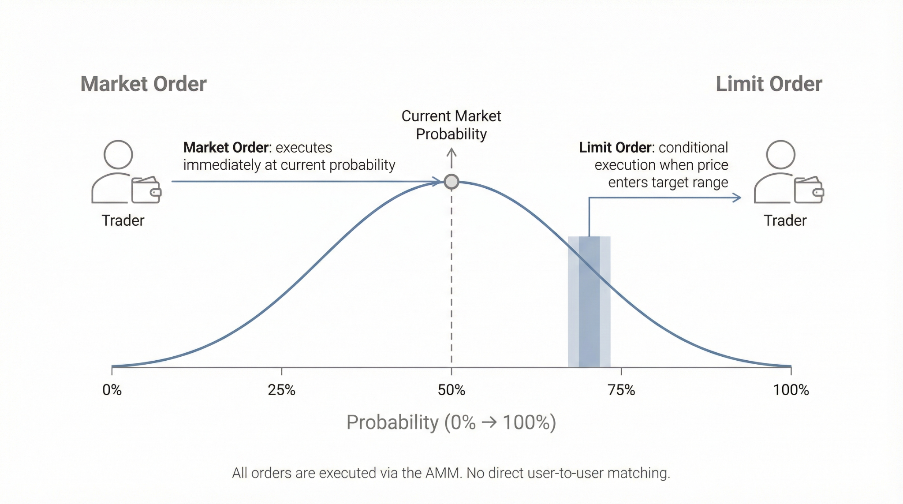

# Protocol Design

## Overview

Orbit structures each market as a time-bounded binary event with on-chain settlement. The protocol separates market initialization, trading, liquidity adjustment, and resolution so that prices remain interpretable throughout the market lifecycle.

## Core Components

### 1. Market Creation

Each market defines:

- A binary YES/NO outcome
- A clear expiry time
- Resolution criteria for final settlement

Trading is not enabled at creation time.

### 2. Belief-Based Liquidity Formation

Before trading begins, liquidity providers commit:

- Capital
- A probability expectation for the YES outcome

These commitments are aggregated into a capital-weighted probability surface. The opening price reflects committed expectations rather than arbitrary launch parameters.

### 3. AMM-Driven Trading

After initialization, traders buy and sell YES/NO outcome tokens through the AMM. In Orbit, the AMM is an execution layer and information aggregation mechanism. It does not determine the market's initial beliefs.

### 4. Dynamic Liquidity Adjustment

As expiry approaches and uncertainty declines, Orbit reduces effective liquidity exposure. This aims to prevent late-stage directional risk from concentrating entirely on liquidity providers.

### 5. Resolution and Settlement

At expiry, the market is resolved based on an external oracle mechanism. Smart contracts settle the winning and losing outcome tokens on-chain.

## Order Types

Orbit supports:

- Market orders for immediate execution at current probabilities
- Limit-order-like behavior through conditional LP positions within the AMM

All execution remains pool-based. Users are not matched directly against each other.

## AI Discovery Layer

Orbit includes an optional AI-assisted discovery and drafting layer. Its role is to surface emerging topics and help structure candidate markets before launch.

These AI components do not:

- Set prices
- Allocate liquidity
- Resolve outcomes
- Override smart contract settlement

They are support tooling, not protocol authority.

## Participant Roles

### Liquidity Providers

Liquidity providers contribute capital and a probability view during initialization. Their core risk is forecast error: if their initial belief is badly wrong, they may lose value over time despite earning fees.

### Traders

Traders enter and exit based on changing information. They use market prices as continuously updated probability signals and interact only with the AMM execution layer.
