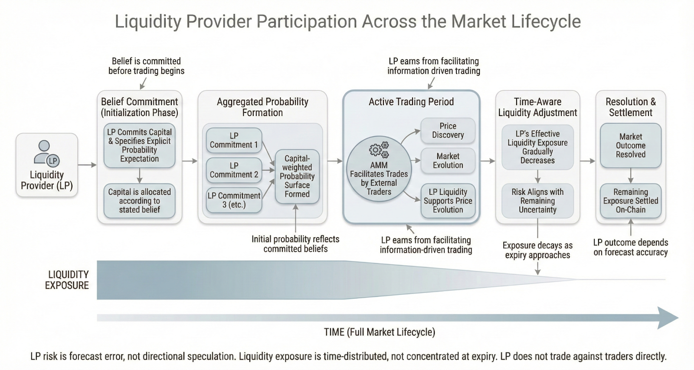
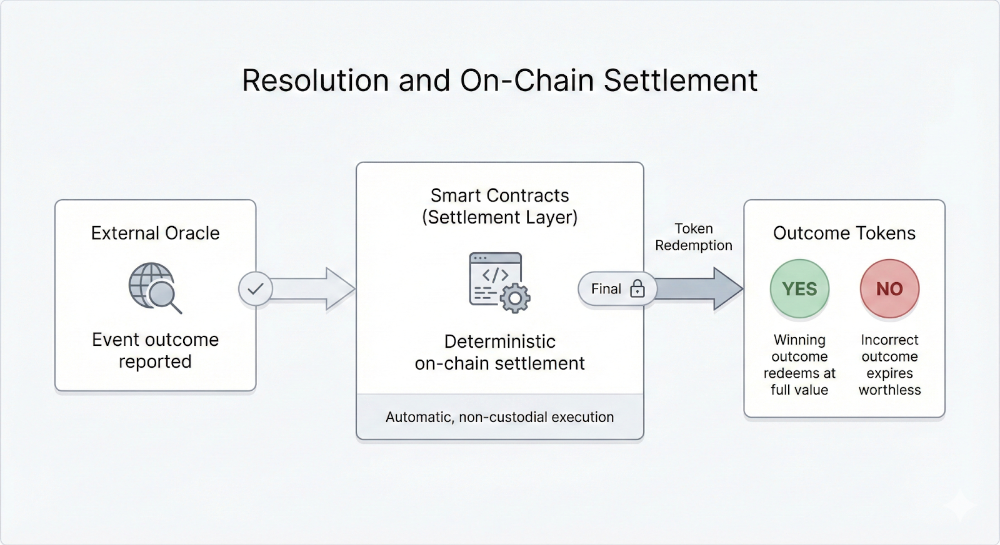
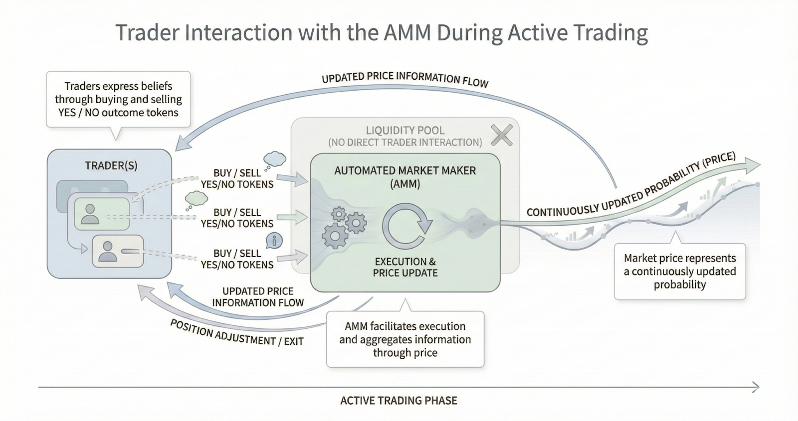

# Market Lifecycle

Each Orbit market progresses through a deterministic lifecycle. The goal is to keep the market interpretable at launch, responsive during trading, and conclusive at settlement.

## Phase 1: Initialization and Belief Formation

A market starts with a clearly defined future event, a binary outcome, and an expiry timestamp.

Liquidity providers then commit capital together with explicit probability expectations. Those commitments are aggregated into the market's opening probability surface.

This phase exists to create an interpretable starting point. Orbit does not rely on heuristic launch prices or early speculative trades to define the initial market state.

## Phase 2: Active Trading

Once the market reaches its initialization threshold, trading begins.

Traders buy and sell YES/NO outcome tokens through the AMM. Prices move continuously as information enters the market, and liquidity is concentrated around relevant probability ranges rather than spread uniformly across the curve.

## Phase 3: Time-Aware Liquidity Adjustment

As time passes, uncertainty naturally compresses. Orbit reflects that by reducing effective liquidity exposure over time.

This is intended to:

- shift risk away from the final moments before expiry
- align LP exposure with residual uncertainty
- preserve tradability without forcing static liquidity to absorb late-stage shocks

## Phase 4: Expiry and Settlement

At expiry, trading stops and the market moves into resolution. An external oracle mechanism reports the event outcome, and smart contracts settle balances deterministically.

- Winning outcome tokens redeem at full value
- Losing outcome tokens expire worthless
- Settlement occurs on-chain without manual intervention

## Participant Views Across the Lifecycle

From an LP perspective, participation is belief-driven before it is yield-driven. Capital is committed up front, fees are earned during trading, and risk is managed across time rather than concentrated entirely at the end.

From a trader perspective, the market is a continuously updating probability surface. Traders can enter, exit, or rebalance positions as information changes before expiry.

## Lifecycle Summary

Orbit markets progress through:

1. Belief formation through committed capital
2. Continuous trading and price evolution
3. Time-adjusted liquidity exposure
4. Deterministic on-chain settlement
